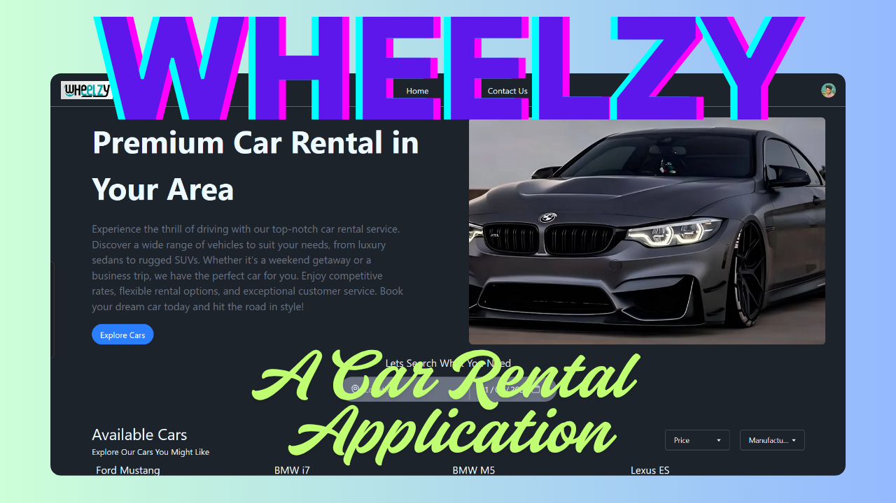

# 🚗 Car Rental Web App

<div align="center">
  
  <h2><a href="https://car-rental-sai.vercel.app/">View Live Demo</a></h2>
</div>

## 📝 Description

A modern, responsive Car Rental web application built with Next.js, TypeScript, and Tailwind CSS. Users can browse available cars, filter by preferences, book vehicles, and view their rental history—all with a beautiful, intuitive UI.

## ✨ Features

- Browse a wide selection of cars with images and details
- Filter cars by brand, type, price, and more
- Book cars with a simple, interactive modal form
- View booking history
- Toast notifications for booking feedback
- Responsive design for desktop and mobile
- Clean, modern UI with smooth transitions

## 🚀 Getting Started

1. Clone the repository:
   ```bash
   git clone https://github.com/sainath-666/car-rental.git
   cd car-rental
   ```
2. Install dependencies:
   ```bash
   npm install
   # or
   yarn install
   ```
3. Run the development server:
   ```bash
   npm run dev
   # or
   yarn dev
   ```
4. Open [http://localhost:3000](http://localhost:3000) in your browser to see the app.

## 🛠️ Technologies Used

- Next.js 14 (App Router)
- TypeScript
- Tailwind CSS
- React Context API
- Modern CSS (responsive design)
- Vercel (for deployment)

## 📦 Project Structure

- `app/` – Main application pages and layouts
- `components/` – Reusable UI components (NavBar, CarCard, BookingModal, etc.)
- `context/` – React Context for global state (e.g., booking flag)
- `services/` – API and data fetching logic
- `public/` – Static assets (images, icons)

## 🔄 Future Improvements

- User authentication and profiles
- Payment integration
- Admin dashboard for car management
- Reviews and ratings for cars
- Advanced search and filtering
- Multi-language support

## 📱 Mobile Support

The app is fully responsive and optimized for all devices, including smartphones and tablets.

## 👨‍💻 Connect with the Developer

- [GitHub](https://github.com/your-username)
- [LinkedIn](https://www.linkedin.com/in/your-linkedin)

<div align="center">
  <p>Made with ❤️ by Your Name</p>
</div>
